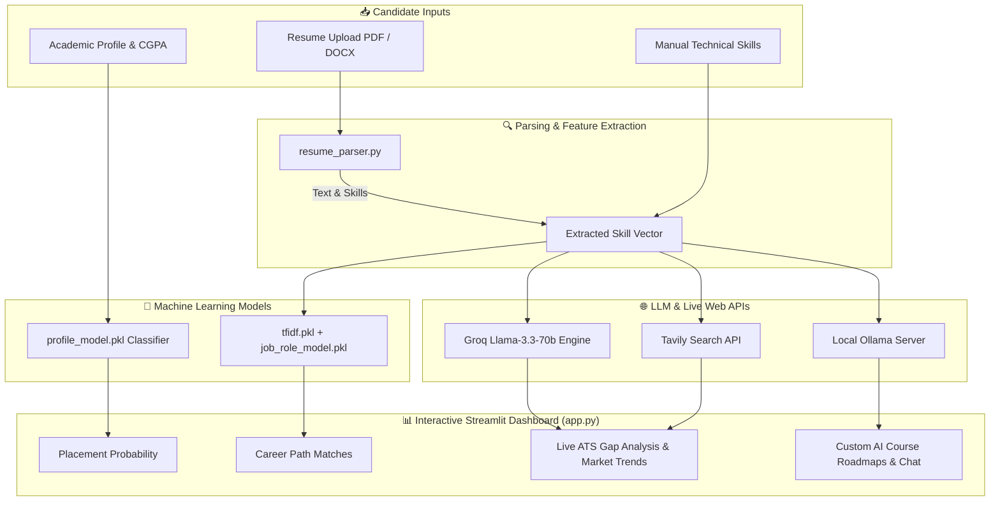

# 🤖 AI Hybrid Job Recommender, ATS Gap Analyzer & AI Course Generator

A state-of-the-art hybrid Machine Learning & LLM platform that predicts student placement opportunities, analyzes technical career paths, performs ATS resume gap analysis, fetches real-time web job market insights, and automatically generates structured multi-week AI learning courses.

---

## 🌟 Key Features & Capability Matrix

### 1. 🎓 Academic Placement Opportunity Predictor (`profile_model.pkl`)
* **Inputs**: Academic Branch (CSE, IT, ECE, EEE, Mech, Civil), CGPA, College Tier (1, 2, 3), Coding Score, Aptitude Score, Communication Rating, Internships, Projects, Backlogs, and DSA Proficiency.
* **Output**: Placement eligibility predictions and profile-level job recommendations powered by trained Machine Learning models (`profile_model.pkl` and `profile_encoders.pkl`).

### 2. ⚡ Technical Skill Career Path Recommender (`job_role_model.pkl`)
* **Core Technology**: TF-IDF Vectorizer (`tfidf.pkl`) + Label Encoders (`label_encoder.pkl`) + Scikit-Learn Classifier (`job_role_model.pkl`).
* **Functionality**: Takes user technical skills (or skills automatically extracted from uploaded resumes) and calculates precision match probabilities for target career paths.

### 3. 📄 Automated Resume Parser & ATS Gap Analyzer (`resume_parser.py` & `skill_mapper.py`)
* **Parsing**: Supports **PDF** (`pdfplumber`) and **DOCX** (`python-docx`) resume uploads.
* **Extraction**: Extracts raw candidate text and identifies key technical skills using NLP and LLM APIs (`llama-3.3-70b-versatile` via Groq).
* **Gap Analysis**: Compares extracted skills against target job profiles in `role_skills.json`, calculating an **ATS Match Score (%)**, identifying **Matched Skills**, and highlighting **Missing Skills**.

### 4. 🌐 Real-Time Job Market Insights (`tavily_helper.py` & `resource_search.py`)
* **Live Search**: Integrates **Tavily Web Search API** to fetch up-to-date industry trends, in-demand technologies, hiring companies, and salary benchmarks.
* **Resource Discovery**: Automatically retrieves targeted **YouTube Tutorials**, **GitHub Repositories**, **Official Documentation**, and **Research Papers** for missing skills.

### 5. 📚 AI Multi-Week Course Generator & Ollama Chatbot (`course_generator.py`)
* **Course Generator**: Generates customized 4 to 24-week structured courses complete with weekly modules, daily breakdowns, and learning objectives.
* **Offline AI Tutor**: Connects to local **Ollama** LLMs (`http://localhost:11434`) for interactive offline course Q&A and tutoring.

### 6. 🎨 Glassmorphic Dark-Mode UI (`app.py`)
* Built using **Streamlit** with custom CSS styling featuring glassmorphism cards, glowing ATS score gauges, interactive pill badges, and responsive multi-column layouts.

---

## 💻 Tech Stack: Frontend & Backend Breakdown

### 🎨 Frontend Architecture & Interface Layer
* **UI Framework**: [Streamlit](https://streamlit.io/) (v1.30.0+) for reactive, stateful Python web application rendering.
* **Design System & Aesthetics**:
  - Dark-mode glassmorphic interface with `radial-gradient` dynamic backgrounds (`#1e1b4b` to `#030712`).
  - Google Font integration ([`Plus Jakarta Sans`](https://fonts.google.com/specimen/Plus+Jakarta+Sans)).
  - Glassmorphic card containers (`backdrop-filter: blur(16px)` with glowing subtle borders).
* **Interactive UI Elements**:
  - **Circular ATS Gauge Chart**: Dynamic HSL radial color-code (`#10b981` green for High, `#f59e0b` amber for Mid, `#ef4444` red for Low).
  - **Skill Pill Badges**: Styled badges categorizing **Matched Skills** vs. **Missing Skills**.
  - **Gradient Probability Bar Charts**: `linear-gradient` filled progress bars for candidate role match probabilities.
  - **Sidebar Controls**: Engine status monitors, fallback mode toggles, and cache invalidation.

### ⚙️ Backend Architecture & Service Layer
* **Core Language**: Python 3.9+
* **Machine Learning & Data Science**:
  - `scikit-learn` & `joblib`: Model inference engine for `profile_model.pkl` and `job_role_model.pkl`.
  - `pandas`: Data manipulation, encoding, and array transformation.
* **Document Parsing Engine**:
  - `pdfplumber`: Accurate PDF document text & metadata extraction.
  - `python-docx`: DOCX paragraph and table parsing.
* **Artificial Intelligence & LLM Integrations**:
  - **Groq API Client**: High-speed inference using `llama-3.3-70b-versatile` for JSON skill extraction, gap analysis, and course outline generation.
  - **Ollama Client**: Local REST connection (`http://localhost:11434`) for offline course generation & AI chatbot assistance.
* **Real-time Web Search Engine**:
  - **Tavily AI Search Client**: Industry trends, salary benchmarks, hiring companies, YouTube tutorials, GitHub repos, docs, and research paper links.

---

## 🏗️ Architecture & Component Overview



---

## 🔄 End-to-End System Workflow

```
[Candidate Input / Resume Upload]
               │
               ▼
[Step 1: Text & Skill Extraction (resume_parser.py)]
  ├── Extracts raw text from PDF/DOCX (pdfplumber/docx)
  └── Prompts Groq AI (Llama-3.3-70b) to return structured skills JSON
               │
               ▼
[Step 2: Dual ML Prediction Engine (app.py)]
  ├── Academic Placement Model (profile_model.pkl) ──► Placement Eligibility Score
  └── Skill Career Path Recommender (job_role_model.pkl + tfidf.pkl) ──► Top Matching Roles (%)
               │
               ▼
[Step 3: Fallback Logic & Decision Engine]
  ├── High ML Confidence (>=35%)? ──► Use ML Predictions
  ├── Low ML Confidence, High DB Match (>=30%)? ──► Fallback to role_skills.json Cosine Match
  └── Low ML & DB Confidence (<30%)? ──► Trigger Groq AI Career Advisor Fallback
               │
               ▼
[Step 4: ATS Gap Analysis & Skill Alignment (skill_mapper.py)]
  ├── Calculates ATS Score Gauge (%)
  ├── Highlights Matched Skills (Green Badges)
  └── Identifies Missing Skills (Red Badges)
               │
               ▼
[Step 5: Real-Time Market Search & Resource Discovery (tavily_helper.py / resource_search.py)]
  ├── Searches Tavily API for live salary data, hiring trends & top tech stacks
  └── Discovers YouTube courses, GitHub repos, docs & research papers for missing skills
               │
               ▼
[Step 6: AI Course Generation & Interactive Tutoring (course_generator.py)]
  ├── Generates 4 to 24-week customized study roadmap via Groq AI
  ├── Breaks roadmap into weekly modules & daily task breakdowns
  └── Offers local Ollama chatbot integration for offline Q&A tutoring
```

---

## 📁 Repository Structure

```
job-pred-updated/
├── app.py                  # Main Streamlit web application & UI engine
├── resume_parser.py        # PDF/DOCX text extraction & Groq skill extraction
├── skill_mapper.py         # TF-IDF similarity calculation & DB role mapping
├── tavily_helper.py        # Tavily AI Search & Groq market insight helper
├── course_generator.py     # Multi-phase AI course generator & Ollama chatbot
├── resource_search.py      # Targeted YouTube, GitHub & Documentation search
├── role_skills.json        # Database mapping job roles to target technical skills
├── profile_model.pkl       # Trained ML model for academic placement prediction
├── profile_encoders.pkl    # Label encoders for academic branch and job profiles
├── job_role_model.pkl      # Trained ML model for skill-to-role classification
├── tfidf.pkl               # TF-IDF Vectorizer for technical skills
├── label_encoder.pkl       # Label encoder for skill-based job roles
├── Dockerfile              # Docker container build script
├── .dockerignore           # Docker build exclusion rules
├── requirements.txt        # Python package dependencies
├── .env                    # Environment variables (GROQ_API_KEY, TAVILY_API_KEY)
└── README.md               # Project documentation
```

---

## ⚙️ Installation & Local Setup Guide

### 1. Prerequisites
* **Python**: 3.9, 3.10, or 3.11 recommended.
* **Ollama** *(Optional, for offline AI Course Chatbot)*: Installed and running locally on port `11434`.

### 2. Install Required Dependencies
```bash
cd c:/total/job-pred-updated

# Create virtual environment
python -m venv venv

# Activate virtual environment
# Windows:
venv\Scripts\activate
# Linux/macOS:
source venv/bin/activate

# Install dependencies from requirements.txt
pip install -r requirements.txt
```

### 3. Configure Environment Variables (`.env`)
Create a `.env` file in the root directory:

```env
GROQ_API_KEY=your_groq_api_key_here
TAVILY_API_KEY=your_tavily_api_key_here
```

### 4. Run Locally
```bash
streamlit run app.py
```
App opens at `http://localhost:8501`.

---

## 🚀 Deployment Guide (Production & Cloud Hosting)

This project can be deployed to production using multiple deployment targets:

### Option 1: ☁️ Streamlit Community Cloud (Recommended - Free & Instant)
1. Push your repository to GitHub.
2. Visit [share.streamlit.io](https://share.streamlit.io/) and log in with GitHub.
3. Click **New app**, select your repository, branch (`main`), and set Main file path to `app.py`.
4. In **Advanced settings**, add your Environment Variables under **Secrets**:
   ```toml
   GROQ_API_KEY = "gsk_..."
   TAVILY_API_KEY = "tvly-..."
   ```
5. Click **Deploy!** Your app will be live with an SSL HTTPS URL.

---

### Option 2: 🐳 Docker Container Deployment (Local / AWS / GCP / Azure)

#### 1. Build Docker Image
```bash
docker build -t ai-job-recommender .
```

#### 2. Run Docker Container
```bash
docker run -d -p 8501:8501 --env-file .env --name job-recommender-app ai-job-recommender
```
Access the application at `http://localhost:8501`.

---

### Option 3: 🌐 Deploying on Render / Railway / Hugging Face Spaces

* **Render**:
  1. Create a new **Web Service** on [Render.com](https://render.com/).
  2. Select **Docker** environment (or Python environment with `streamlit run app.py --server.port=$PORT`).
  3. Add `GROQ_API_KEY` and `TAVILY_API_KEY` in Environment Variables.

* **Hugging Face Spaces**:
  1. Create a new Space on [Hugging Face](https://huggingface.co/spaces).
  2. Select **Streamlit** SDK.
  3. Upload the project files and set Secrets under **Space Settings**.

---

## 🤝 Fallback Architecture & Rules

1. **Local Machine Learning Models**: Evaluates candidate metrics against trained models (`profile_model.pkl` and `job_role_model.pkl`).
2. **Rule-Based Skill Database**: If confidence is low, falls back to `role_skills.json` database matching.
3. **AI Fallback Advisor**: If prediction confidence is `<35%` and DB match is `<30%`, the system calls Groq AI (`llama-3.3-70b-versatile`) to generate intelligent career suggestions and missing skill recommendations.

---

## 🚀 Future Roadmap & Planned Add-On Features

### 1. 🎙️ AI Voice Mock Interview Simulator
* Real-time voice agent to conduct role-specific technical & behavioral interviews.

### 2. 📄 Automated ATS Resume Builder & Tailored PDF Exporter
* One-click PDF resume generator tailored to target job descriptions.

### 3. 🎯 Real-Time Live Job Portal Integration (LinkedIn / Indeed)
* Live job scraping and 1-click candidate compatibility scoring.

### 4. 🏆 Embedded Coding Sandbox & Automated Skill Verification
* In-browser Docker / WebAssembly code sandbox for hands-on skill badges.

### 5. 🏫 Enterprise University & Placement Cell Analytics Portal
* Batch analytics dashboard for college placement heads.

---

## 📜 License

Distributed under the MIT License. See `LICENSE` for more information.
