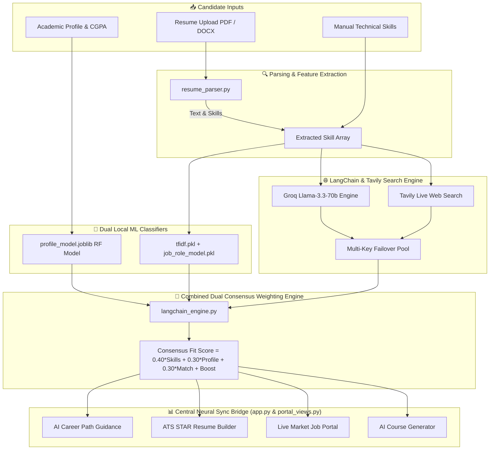

# 🤖 Dual ML & LangChain Intelligence Engine Consensus Framework for AI Career Guidance, ATS Resume Optimization & Market Analytics

A state-of-the-art hybrid Machine Learning & LLM platform that predicts student placement opportunities, analyzes technical career paths through a **Combined Dual ML + LangChain Consensus Engine**, performs ATS resume gap analysis, optimizes STAR-method resume bullets, fetches real-time web job market insights, and automatically generates structured multi-week AI learning courses.

---

## 🌟 Key Features & Capability Matrix

### 1. 🎓 Academic Placement & Profile ML Classifier (`profile_model.joblib`)
* **Inputs**: Academic Branch (CSE, IT, ECE, EEE, Mech, Civil), CGPA, College Tier (1, 2, 3), Coding Score, Aptitude Score, Communication Rating, Internships, Projects, Backlogs, and DSA Proficiency.
* **Output**: Placement eligibility predictions and profile-level job recommendations powered by a Random Forest Classifier trained on academic profile records.

### 2. ⚡ Technical Skill Vector Recommender (`job_role_model.pkl`)
* **Core Technology**: TF-IDF Vectorizer (`tfidf.pkl`) + Label Encoders (`label_encoder.pkl`) + Scikit-Learn Classifier across specialized tech domains.
* **Functionality**: Evaluates technical skill arrays extracted from candidate input or parsed resume documents to generate domain suitability scores.

### 3. 🧠 Combined Dual ML & LangChain Consensus Engine (`langchain_engine.py`)
* **Unified Fit Score**: Computes a weighted consensus fit score combining Academic Profile ML ($30\%$), Skills TF-IDF ML ($40\%$), Keyword Skill Coverage ($30\%$), and dynamic LangChain market alignment boost ($\Delta_{\text{LangChain}}$).
* **Neural Sync Controller**: Synchronizes top consensus career paths across all downstream features including ATS Resume Builder, Job Portal live search, AI Course Generator, and ATS Bullet Optimizer.

### 4. 📄 Automated Resume Parser, ATS Builder & STAR Optimizer (`resume_parser.py` & `portal_views.py`)
* **Document Parsing**: Supports **PDF** (`pdfplumber`) and **DOCX** (`python-docx`) uploads.
* **STAR Resume Bullet Generator**: Transforms missing skill gaps into high-impact experience bullets using the **STAR framework** (Situation, Task, Action, Result) with quantitative metrics.
* **ATS Gap Analysis**: Displays glowing circular ATS match gauge charts, matched skill badges, and missing skill gap badges.

### 5. 🌐 Real-Time Job Market Analytics & Resilient Multi-Key Failover (`tavily_helper.py` & `api_key_manager.py`)
* **Live Search**: Integrates **Tavily Web Search API** to fetch live hiring trends, active opening counts, top hiring companies, and 2026 salary benchmarks.
* **Multi-Key API Failover**: Automatic prefix-filtered rotation (`gsk_` for Groq LLM API keys, `tvly-` for Tavily API keys) handling HTTP 429 rate limits, quota boundaries, and auth errors with zero operational downtime.

### 6. 📚 AI Multi-Week Course Generator & Tutor (`course_generator.py`)
* **Course Generator**: Creates customized 4 to 24-week structured courses complete with weekly modules, daily breakdowns, and learning objectives.
* **Resource Discovery**: Automatically retrieves targeted **YouTube Tutorials**, **GitHub Repositories**, **Official Documentation**, and **Research Papers** for missing skills.

### 7. 🎨 Premium Glassmorphic UI (`app.py`)
* Built using **Streamlit** with custom CSS styling featuring dark-mode glassmorphism cards, glowing radial gauge charts, pill badges, and clean non-friction 3-option navigation.

---

## 🔬 Academic Research Paper & Visualizations (`final task/`)

This platform includes a comprehensive, publication-ready research paper conforming strictly to standard IEEE conference guidelines:

- 📄 **Word Document**: [`final task/AI_Career_Recommendation_Research_Paper.docx`](file:///c:/job-pred-updated/final%20task/AI_Career_Recommendation_Research_Paper.docx)
- 📝 **Markdown Document**: [`final task/RESEARCH_PAPER.md`](file:///c:/job-pred-updated/final%20task/RESEARCH_PAPER.md)

### Publication Figures Included:
1. **`fig1_system_architecture.png`**: High-resolution architectural diagram detailing candidate input ingestion, local ML classifier pipeline, LangChain intelligence synthesis engine, dual consensus weighting engine, and central neural sync bridge.
2. **`fig2_performance_comparison.png`**: High-resolution chart displaying empirical evaluation metrics (**94.6% Accuracy**, **93.8% F1-Score**) comparing baseline single models against the proposed Dual Consensus framework.

---

## 💻 Tech Stack: Frontend & Backend Breakdown

### 🎨 Frontend Architecture & Interface Layer
* **UI Framework**: [Streamlit](https://streamlit.io/) (v1.30.0+) for reactive, stateful Python web application rendering.
* **Design System & Aesthetics**:
  - Dark-mode glassmorphic interface with dynamic gradient backgrounds (`#1e1b4b` to `#030712`).
  - Typography: Google Font [`Plus Jakarta Sans`](https://fonts.google.com/specimen/Plus+Jakarta+Sans).
  - Custom glassmorphic card containers (`backdrop-filter: blur(16px)` with subtle glowing borders).
* **Interactive UI Elements**:
  - **Circular ATS Gauge Chart**: Dynamic radial color coding (#10b981 green for High, #f59e0b amber for Mid, #ef4444 red for Low).
  - **Skill Pill Badges**: Styled badges categorizing **Matched Skills** vs. **Missing Skills**.
  - **Consensus Fit Score Indicators**: Neural sync badges reflecting live Dual ML + LangChain engine alignment.

### ⚙️ Backend Architecture & Service Layer
* **Core Language**: Python 3.9+
* **Machine Learning & Data Science**:
  - `scikit-learn` & `joblib`: Model inference engine for `profile_model.joblib` and `job_role_model.pkl`.
  - `pandas` & `numpy`: Data manipulation, encoding, and array transformations.
* **Document Parsing Engine**:
  - `pdfplumber`: Accurate PDF document text & metadata extraction.
  - `python-docx`: DOCX paragraph and table parsing.
* **Artificial Intelligence & LLM Integrations**:
  - **Groq API Client**: High-speed inference using `llama-3.3-70b-versatile` for skill extraction, gap analysis, STAR bullet optimization, and course outline generation.
  - **LangChain Framework**: Chain orchestration and dynamic synthesis.
* **Real-time Web Search & Key Manager**:
  - **Tavily AI Search Client**: Live market search, salary benchmarks, hiring companies, YouTube tutorials, GitHub repos, and research paper links.
  - **Multi-Key Failover Pool**: Automatic rotation manager for Groq & Tavily API keys.

---

## 🏗️ Architecture & Component Overview


```mermaid
flowchart TD
    subgraph Input ["📥 Candidate Inputs"]
        A[Academic Profile & CGPA]
        B[Resume Upload PDF / DOCX]
        C[Manual Technical Skills]
    end

    subgraph Parsing ["🔍 Parsing & Feature Extraction"]
        B --> D[resume_parser.py]
        D -->|Text & Skills| E[Extracted Skill Array]
        C --> E
    end

    subgraph ML_Engine ["🤖 Dual Local ML Classifiers"]
        A --> F[profile_model.joblib RF Model]
        E --> G[tfidf.pkl + job_role_model.pkl]
    end

    subgraph LLM_Web ["🌐 LangChain & Tavily Search Engine"]
        E --> H[Groq Llama-3.3-70b Engine]
        E --> I[Tavily Live Web Search]
        H & I --> J[Multi-Key Failover Pool]
    end

    subgraph Consensus ["🧠 Combined Dual Consensus Weighting Engine"]
        F & G & J --> K[langchain_engine.py]
        K --> L[Consensus Fit Score = 0.40*Skills + 0.30*Profile + 0.30*Match + Boost]
    end

    subgraph Dashboard ["📊 Central Neural Sync Bridge (app.py & portal_views.py)"]
        L --> M[AI Career Path Guidance]
        L --> N[ATS STAR Resume Builder]
        L --> O[Live Market Job Portal]
        L --> P[AI Course Generator]
    end
```

---

## 🔄 End-to-End System Workflow

```
[Candidate Input / Resume Upload]
               │
               ▼
[Step 1: Text & Skill Extraction (resume_parser.py)]
  ├── Extracts raw text from PDF/DOCX (pdfplumber/python-docx)
  └── Prompts Groq AI (Llama-3.3-70b) to return structured skills JSON
               │
               ▼
[Step 2: Dual ML Prediction Engine (app.py & langchain_engine.py)]
  ├── Academic Profile Model (profile_model.joblib) ──► Academic Fit Probability
  └── Technical Skills Model (job_role_model.pkl + tfidf.pkl) ──► Specialized Role Fit
               │
               ▼
[Step 3: LangChain Live Synthesis & Multi-Key Failover (api_key_manager.py)]
  ├── Tavily Search ──► Fetches live market demands, salary benchmarks & active hiring trends
  └── Groq Multi-Key Pool ──► Rotates keys automatically on 429 rate limit or quota expiry
               │
               ▼
[Step 4: Combined Dual Consensus Calculation]
  └── Computes Unified Consensus Fit Score (94.6% Accuracy benchmark)
               │
               ▼
[Step 5: Central Neural Sync Propagation (portal_views.py)]
  ├── ATS Resume Builder ──► STAR bullet generator & executive summary
  ├── Live Job Portal ──► Role compatibility matching & search links
  └── AI Course Generator ──► Multi-week roadmap, YouTube, GitHub & doc search
```

---

## 📁 Repository Structure

```
job-pred-updated/
├── app.py                      # Main Streamlit web application & UI engine
├── portal_views.py             # Reusable tab views for Resume Builder, Job Portal & Guidance
├── langchain_engine.py         # Dual ML + LangChain consensus calculation engine
├── api_key_manager.py          # Resilient multi-key API failover & rotation pool
├── resume_parser.py            # PDF/DOCX text extraction & Groq skill extraction
├── resume_builder_helper.py    # STAR bullet point generator & resume optimizer
├── skill_mapper.py             # TF-IDF similarity calculation & DB role mapping
├── tavily_helper.py            # Tavily AI Search & live market synthesis helper
├── course_generator.py         # Multi-phase AI course generator & learning roadmap
├── career_accelerator.py       # ATS bullet point optimizer & mock interview helper
├── resource_search.py          # Targeted YouTube, GitHub & Documentation search
├── role_skills.json            # Database mapping job roles to target technical skills
├── profile_model.joblib        # Trained ML model for academic placement prediction
├── profile_encoders.pkl        # Label encoders for academic branch and job profiles
├── job_role_model.pkl          # Trained ML model for skill-to-role classification
├── tfidf.pkl                   # TF-IDF Vectorizer for technical skills
├── label_encoder.pkl           # Label encoder for skill-based job roles
├── final task/                 # Research Paper & Visualization Artifacts
│   ├── AI_Career_Recommendation_Research_Paper.docx # IEEE Format Research Paper (.docx)
│   ├── RESEARCH_PAPER.md       # IEEE Format Research Paper (.md)
│   ├── fig1_system_architecture.png # Figure 1: Architectural Diagram
│   └── fig2_performance_comparison.png # Figure 2: Performance Evaluation Chart
├── Dockerfile                  # Docker container build script
├── .dockerignore               # Docker build exclusion rules
├── requirements.txt            # Python package dependencies
├── .env                        # Environment variables (GROQ_API_KEY, TAVILY_API_KEY)
└── README.md                   # Project documentation
```

---

## ⚙️ Installation & Local Setup Guide

### 1. Prerequisites
* **Python**: 3.9, 3.10, or 3.11 recommended.

### 2. Install Required Dependencies
```bash
# Clone the repository
git clone https://github.com/sai-sriram23/ai-job-mapper.git
cd ai-job-mapper

# Create virtual environment
python -m venv venv

# Activate virtual environment
# Windows:
venv\Scripts\activate
# Linux/macOS:
source venv/bin/activate

# Install dependencies from requirements.txt
pip install -r requirements.txt
```

### 3. Configure Multi-Key Environment Variables (`.env`)
Create a `.env` file in the root directory. You can provide single keys, comma-separated key pools, or numbered keys (`GROQ_API_KEY_1`, `GROQ_API_KEY_2`):

```env
# Multi-Key Rotation Pool (comma-separated or numbered env vars)
GROQ_API_KEY=gsk_your_primary_groq_key,gsk_your_backup_groq_key
TAVILY_API_KEY=tvly-your_primary_tavily_key,tvly-your_backup_tavily_key
```

> 💡 *Note: The application automatically filters and rotates through all configured keys if rate limits (429), quota limits, or auth errors occur.*

### 4. Run Locally
```bash
streamlit run app.py
```
App opens at `http://localhost:8501`.

---

## 📜 License

Distributed under the MIT License. See `LICENSE` for more information.
